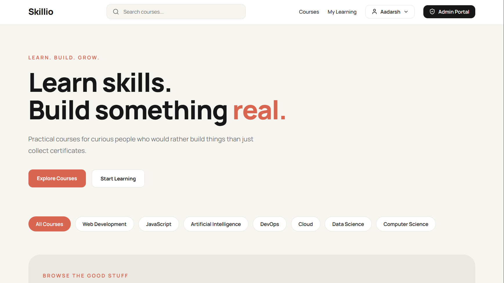

# Skillio — Online Learning Platform

**A Full Stack MERN Application for Online Course Discovery, Enrollment, and Learning Progress Tracking**

Skillio is a web-based learning platform that allows users to explore courses, create accounts, enroll in courses, and track their learning progress. It also provides an administrator interface for managing course listings.

The application is built using React, Node.js, Express.js, and MongoDB, with JWT-based authentication and role-specific authorization for users and administrators.

The project focuses on implementing practical full-stack development concepts, including REST API integration, database modeling, authentication middleware, protected routes, CRUD operations, and frontend-backend communication.

---

## Table of Contents

* [Project Overview](#project-overview)
* [Features](#features)
* [Screenshots](#screenshots)
* [Technology Stack](#technology-stack)
* [Application Architecture](#application-architecture)
* [Project Structure](#project-structure)
* [Database Models](#database-models)
* [API Endpoints](#api-endpoints)
* [Getting Started](#getting-started)
* [Environment Variables](#environment-variables)
* [Running the Application](#running-the-application)
* [Authentication and Authorization](#authentication-and-authorization)
* [Learning Progress Tracking](#learning-progress-tracking)
* [Future Improvements](#future-improvements)
* [Learning Outcomes](#learning-outcomes)
* [Author](#author)

---

## Project Overview

Skillio provides a centralized platform for discovering and accessing educational courses across categories such as:

* Web Development
* JavaScript
* Artificial Intelligence
* DevOps
* Cloud Computing
* Data Structures and Algorithms
* Python

The application separates learner functionality from administrative functionality.

Learners can register, sign in, explore available courses, enroll in courses, access course lessons, and track completed lessons.

Administrators can sign in to a protected dashboard, create new courses, update course information, and delete courses they manage.

The frontend communicates with a custom Express REST API, while MongoDB stores application data.

### Project Goals

* Build a functional full-stack application using the MERN stack.
* Implement authentication using JSON Web Tokens.
* Protect user and administrator routes.
* Design MongoDB schemas for users, administrators, courses, purchases, and learning progress.
* Connect React components to backend REST API endpoints.
* Implement course management and enrollment workflows.
* Track lesson completion for enrolled learners.

---

## Features

### 1. User Authentication

* User registration and sign-in.
* Password hashing using bcrypt.
* JWT-based authentication.
* Protected user-specific routes.
* User profile retrieval.
* Password change functionality.

### 2. Course Discovery

* Browse courses through a dedicated course interface.
* Explore courses by category.
* View course information, including descriptions, prices, and images.
* Open individual course detail pages.

### 3. Course Enrollment

* Enroll in available courses.
* Associate course purchases with authenticated users.
* Prevent duplicate enrollments using application-level checks and a compound database index.
* Retrieve enrolled courses for the current user.

**Note:** Enrollment currently records a purchase in the database. A payment gateway and real payment processing are not implemented.

### 4. Learning Dashboard

* View courses associated with the logged-in learner.
* Access enrolled course content.
* View available lessons.
* Mark lessons as completed.
* Store completed lesson information in MongoDB.

### 5. Administrator Dashboard

* Administrator sign-in.
* Protected administrative routes.
* Create courses.
* Update existing course information.
* Delete courses.
* Retrieve courses created by the authenticated administrator.
* Associate courses with their creator.

Public administrator registration is disabled in the current implementation.

### 6. User Profile and Settings

* View account information.
* Change the account password.
* Access protected profile and settings pages.

### 7. Frontend Navigation and User Experience

* React component-based architecture.
* Client-side routing with React Router.
* Separate pages for authentication, course discovery, learning, profile management, and administration.
* Reusable interface components.
* Responsive styling using Tailwind CSS.
* Interactive interface elements and iconography using Lucide React.

---

## Screenshots

Screenshots of the application help visitors understand its interface without running the project locally.

Add screenshots of the actual running application here.

### Home Page

<!-- Replace with your actual screenshot -->




### Course Listing

<!-- Replace with your actual screenshot -->


### Authentication

<!-- Replace with your actual screenshot -->


### Course Details

<!-- Replace with your actual screenshot -->


### Learning Dashboard

<!-- Replace with your actual screenshot -->


### Administrator Dashboard

<!-- Replace with your actual screenshot -->


---

## Technology Stack

### Frontend

| Technology   | Purpose                                           |
| ------------ | ------------------------------------------------- |
| React        | Component-based user interface                    |
| Vite         | Frontend development server and build tooling     |
| React Router | Client-side navigation and protected page routing |
| Axios        | HTTP requests to the backend API                  |
| Tailwind CSS | Interface styling                                 |
| Lucide React | Icons                                             |

### Backend

| Technology     | Purpose                                    |
| -------------- | ------------------------------------------ |
| Node.js        | JavaScript runtime                         |
| Express.js     | REST API and request handling              |
| MongoDB        | Application database                       |
| Mongoose       | Database schemas, models, and queries      |
| JSON Web Token | Authentication tokens                      |
| bcrypt         | Password hashing and password verification |
| Zod            | Request data validation                    |
| dotenv         | Environment variable configuration         |
| CORS           | Cross-origin request configuration         |

### Development Tools

* Visual Studio Code
* Git
* GitHub
* MongoDB Atlas or another accessible MongoDB deployment
* Postman or an equivalent HTTP client for API testing

---

## Application Architecture

Skillio follows a client-server architecture.

The React frontend communicates with the Express backend through HTTP requests. The backend validates incoming requests, applies authentication middleware where required, interacts with MongoDB through Mongoose, and returns JSON responses.

### High-Level Architecture

```text
                 LEARNER / ADMIN
                        |
                        v
               React Frontend
             React Router + Axios
                        |
                        | HTTP Requests
                        v
                Express REST API
                        |
              +---------+---------+
              |                   |
              v                   v
       Authentication       Request Validation
          Middleware             (Zod)
              |                   |
              +---------+---------+
                        |
                        v
                 Route Handlers
                        |
                        v
                  Mongoose ODM
                        |
                        v
                     MongoDB
                        |
                        v
                 JSON Response
                        |
                        v
                 React UI Update
```

### Example: Course Enrollment Flow

1. A learner opens a course and selects the enrollment button.
2. The React component sends an HTTP POST request containing the course ID.
3. The Express backend receives the request at the course purchase endpoint.
4. Authentication middleware verifies the learner's JWT.
5. The backend checks whether the course exists.
6. The backend checks whether the learner has already enrolled.
7. The purchase record is saved in MongoDB.
8. The API returns a response indicating success or failure.
9. The frontend displays the result and can refresh the learner's course list.

This flow demonstrates how frontend interactions, backend authorization, database operations, and UI updates work together in a full-stack application.

---

## Project Structure

```text
skillio-course-platform/
│
├── Middleware/
│   ├── admin.js
│   └── user.js
│
├── data/
│   └── courseLessons.js
│
├── frontend/
│   ├── public/
│   │   ├── courses/
│   │   ├── favicon.svg
│   │   └── icons.svg
│   │
│   ├── src/
│   │   ├── assets/
│   │   ├── components/
│   │   │   ├── CategoryStrip.jsx
│   │   │   ├── CourseCard.jsx
│   │   │   ├── CourseSection.jsx
│   │   │   ├── Footer.jsx
│   │   │   ├── Hero.jsx
│   │   │   ├── Navbar.jsx
│   │   │   └── ProtectedRoute.jsx
│   │   │
│   │   ├── data/
│   │   │   └── courses.jsx
│   │   │
│   │   ├── pages/
│   │   │   ├── AdminDashboard.jsx
│   │   │   ├── AdminSignIn.jsx
│   │   │   ├── CourseDetails.jsx
│   │   │   ├── Courses.jsx
│   │   │   ├── Learning.jsx
│   │   │   ├── MyLearning.jsx
│   │   │   ├── NotFound.jsx
│   │   │   ├── Profile.jsx
│   │   │   ├── Settings.jsx
│   │   │   ├── SignIn.jsx
│   │   │   └── SignUp.jsx
│   │   │
│   │   ├── utils/
│   │   │   └── auth.js
│   │   │
│   │   ├── axiosConfig.js
│   │   ├── App.jsx
│   │   ├── index.css
│   │   └── main.jsx
│   │
│   ├── package.json
│   └── vite.config.js
│
├── routes/
│   ├── admin.js
│   ├── course.js
│   └── user.js
│
├── config.js
├── db.js
├── index.js
├── package.json
├── .gitignore
└── README.md
```

### Important Directories

**`frontend/src/components/`**

Contains reusable React components used across multiple pages.

**`frontend/src/pages/`**

Contains page-level components for course browsing, authentication, learning, profiles, settings, and administration.

**`routes/`**

Contains Express route handlers for user operations, administrator operations, and course-related operations.

**`Middleware/`**

Contains JWT verification middleware for user and administrator requests.

**`db.js`**

Defines Mongoose schemas and exports database models.

**`data/courseLessons.js`**

Contains predefined lesson information and video identifiers used to provide course content.

**`config.js`**

Reads database connection and JWT secret values from environment variables.

**`index.js`**

Initializes Express, configures middleware and API routes, establishes the MongoDB connection, and starts the backend server.

---

## Database Models

Skillio uses MongoDB with Mongoose to define and interact with application data.

### 1. User

Stores learner account information.

Main fields:

* `email`
* `password`
* `firstName`
* `lastName`
* `createdAt`
* `updatedAt`

Passwords are hashed before being stored.

### 2. Admin

Stores administrator account information.

Main fields:

* `email`
* `password`
* `firstName`
* `lastName`
* `createdAt`
* `updatedAt`

Administrator authentication uses a separate JWT secret and middleware.

### 3. Course

Stores information about individual courses.

Main fields:

* `title`
* `description`
* `price`
* `category`
* `imageUrl`
* `creatorId`
* `createdAt`
* `updatedAt`

The `creatorId` field associates a course with its administrator.

### 4. Purchase

Stores learner enrollment records.

Main fields:

* `userId`
* `courseId`
* `createdAt`
* `updatedAt`

A compound unique index on `userId` and `courseId` helps prevent duplicate purchase records.

### 5. Progress

Stores completed lessons for an enrolled learner.

Main fields:

* `userId`
* `courseId`
* `completedLessons`
* `createdAt`
* `updatedAt`

The `completedLessons` field stores lesson numbers in an array.

A compound unique index on `userId` and `courseId` allows one progress record per learner-course combination.

---

## API Endpoints

The backend exposes REST API routes under `/api/v1`.

### User Routes

Base path: `/api/v1/user`

| Method | Endpoint                     | Description                                     | Authentication |
| ------ | ---------------------------- | ----------------------------------------------- | -------------- |
| POST   | `/signup`                    | Register a new learner                          | No             |
| POST   | `/signin`                    | Authenticate a learner                          | No             |
| GET    | `/me`                        | Retrieve the current user's profile             | User JWT       |
| GET    | `/purchases`                 | Retrieve enrolled courses and progress data     | User JWT       |
| PUT    | `/password`                  | Change the account password                     | User JWT       |
| GET    | `/course/:courseId`          | Retrieve course content for an enrolled learner | User JWT       |
| PUT    | `/course/:courseId/progress` | Update lesson completion progress               | User JWT       |

### Administrator Routes

Base path: `/api/v1/admin`

| Method | Endpoint       | Description                                   | Authentication |
| ------ | -------------- | --------------------------------------------- | -------------- |
| POST   | `/signin`      | Authenticate an administrator                 | No             |
| GET    | `/course/bulk` | Retrieve courses managed by the administrator | Admin JWT      |
| POST   | `/course`      | Create a course                               | Admin JWT      |
| PUT    | `/course`      | Update an existing course                     | Admin JWT      |
| DELETE | `/course`      | Delete a course                               | Admin JWT      |

Administrator registration is disabled in the current code. An administrator account must already exist in the database.

### Course Routes

Base path: `/api/v1/course`

| Method | Endpoint    | Description                                  | Authentication |
| ------ | ----------- | -------------------------------------------- | -------------- |
| GET    | `/bulk`     | Retrieve available courses                   | No             |
| POST   | `/purchase` | Enroll the authenticated learner in a course | User JWT       |

### Authentication Header

Protected API requests use the `token` request header.

Example:

```http
GET /api/v1/user/me
token: YOUR_USER_JWT
```

Administrator endpoints require an administrator token generated through the administrator sign-in endpoint.

**Note:** The tables describe the routes present in the current backend. Response formats and error status codes depend on the individual route implementation.

---

## Getting Started

Follow these instructions to run Skillio locally.

### Prerequisites

Install the following:

* Node.js and npm
* MongoDB Atlas account or a running MongoDB instance
* Git
* A code editor such as Visual Studio Code

### 1. Clone the Repository

```bash
git clone <YOUR_GITHUB_REPOSITORY_URL>
cd skillio-course-platform
```

Replace the repository URL with your actual GitHub repository URL.

### 2. Install Backend Dependencies

From the project root:

```bash
npm install
```

### 3. Configure Environment Variables

Create a `.env` file in the backend project root.

Add the following variables:

```env
PORT=3000
MONGO_URL=your_mongodb_connection_string
JWT_USER_PASSWORD=your_user_jwt_secret
JWT_ADMIN_PASSWORD=your_admin_jwt_secret
```

Replace the example values with your own configuration.

Use strong, private JWT secrets. Never commit the `.env` file or expose database credentials in your repository.

### 4. Configure the Database

Ensure the MongoDB connection string is valid and the database is accessible.

The application connects to MongoDB using Mongoose before starting the Express server.

### 5. Start the Backend

From the project root:

```bash
npm run dev
```

The backend uses Nodemon during development.

The default port is `3000`, unless another port is provided through the environment.

### 6. Install Frontend Dependencies

Open a second terminal:

```bash
cd frontend
npm install
```

### 7. Start the Frontend

```bash
npm run dev
```

Vite will display the local frontend URL in the terminal. Open that URL in your browser.

By default, Vite commonly uses port `5173`.

### 8. Create an Administrator Account

The public administrator sign-up route is disabled.

Create an administrator account through a controlled, private setup process before testing administrator sign-in.

Do not expose a public administrator-registration endpoint in a deployed application without appropriate authorization controls.

---

## Environment Variables

| Variable             | Description                                                             |
| -------------------- | ----------------------------------------------------------------------- |
| `PORT`               | Port on which the backend listens                                       |
| `MONGO_URL`          | MongoDB connection string                                               |
| `JWT_USER_PASSWORD`  | Secret used to sign and verify user JWTs                                |
| `JWT_ADMIN_PASSWORD` | Secret used to sign and verify administrator JWTs                       |
| `VITE_API_URL`       | Optional frontend API URL used by the Axios URL-rewriting configuration |

The first four variables belong to the backend configuration.

`VITE_API_URL` is used by the frontend configuration when rewriting matching localhost API URLs. Set it to the appropriate backend origin when configuring a deployment.

The current frontend contains requests that initially target `http://localhost:3000`. The Axios configuration rewrites those URLs using `VITE_API_URL` or the browser's current origin.

Ensure the deployed frontend and backend URLs are configured correctly before publishing a live version.

---

## Authentication and Authorization

Skillio uses JSON Web Tokens to authenticate users and administrators.

### User Authentication Flow

1. The user submits their email and password.
2. The backend validates the request using Zod.
3. The backend retrieves the user record from MongoDB.
4. bcrypt compares the submitted password with the stored password hash.
5. If the credentials are valid, the backend generates a JWT.
6. The frontend stores the token and uses it for authenticated requests.

### Administrator Authentication Flow

The administrator follows a similar process, but the application uses a separate administrator JWT secret and administrator authentication middleware.

### Protected Routes

The frontend uses a reusable `ProtectedRoute` component to control access to protected pages.

The backend independently verifies JWTs through authentication middleware.

Frontend route protection improves navigation and user experience, while backend authentication protects the actual API operations.

Both layers are important because frontend-only route protection is not sufficient to secure backend resources.

---

## Learning Progress Tracking

Course lessons are defined in the backend's `data/courseLessons.js` file.

When an authenticated learner accesses course content, the backend checks whether the requested course exists and whether the learner has an associated purchase record.

Lesson completion is stored through the progress model.

The completed lesson numbers are maintained in the `completedLessons` array, associated with a particular user and course.

This enables the application to retrieve progress information for enrolled courses and present learning status in the frontend.

The lesson content is currently predefined rather than managed through a separate lesson-management interface.

---

## Future Improvements

The following improvements could extend Skillio beyond its current functionality.

* Integrate a payment gateway for actual course payments.
* Replace predefined course lessons with database-managed lesson content.
* Add automated backend and frontend tests.
* Introduce centralized error-handling middleware.
* Improve request validation and error response consistency.
* Use a shared Axios instance with configurable API URLs.
* Improve authorization and session handling.
* Add pagination, sorting, and server-side course filtering.
* Add course ratings and reviews.
* Add course search and advanced filtering.
* Improve accessibility and responsive design.
* Deploy the frontend and backend with production-ready environment configuration.
* Add API documentation using Swagger or OpenAPI.

These are potential enhancements, not claims about features already implemented.

---

## Learning Outcomes

This project provides practical experience with:

* Full-stack application architecture.
* React components and client-side routing.
* REST API development with Express.
* Frontend-backend integration using Axios.
* MongoDB schema design and Mongoose queries.
* JWT-based authentication.
* Role-specific authorization middleware.
* Password hashing and verification.
* Request validation using Zod.
* CRUD operations.
* Course enrollment and learning progress data modeling.
* Environment variables and application configuration.
* Git and GitHub-based version control.

---

## Author

**Aadarsh Singh**

B.Tech Computer Science and Engineering Student

Interested in full-stack development,Devops, backend engineering, and building practical web applications.

* GitHub: [(https://github.com/singhaadarsh1)]
* LinkedIn: [(https://www.linkedin.com/in/aadarsh-singh-ba061628a/?isSelfProfile=true)]

---

## License
This project is licensed under the MIT License.